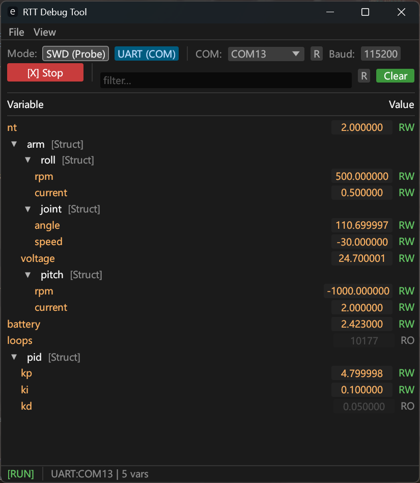

<h1 align="center">
  
   
  Continuation of <a href="https://github.com/XieFField/RTT_DebugTool">RTT_DebugTool</a>
   
</h1>

<h3 align="center">
A Debug Tool based on <a href="https://github.com/probe-rs/probe-rs">Probe-rs</a>
</h3>

  Languages:
  <a href="./README.md">简体中文</a> ·
  <a href="./docs/README_en.md">English</a> ·

<h2>
页面预览
</h2>
  
  
 
  

