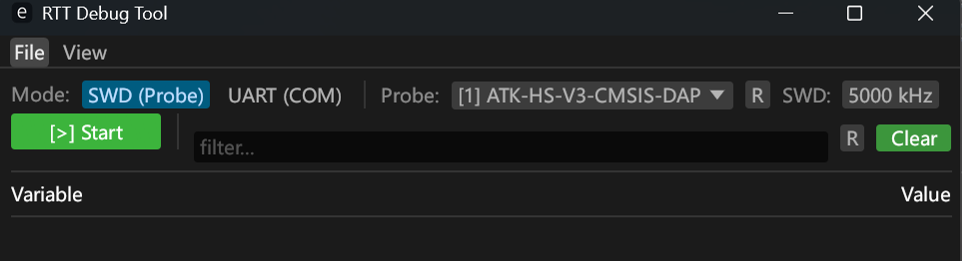
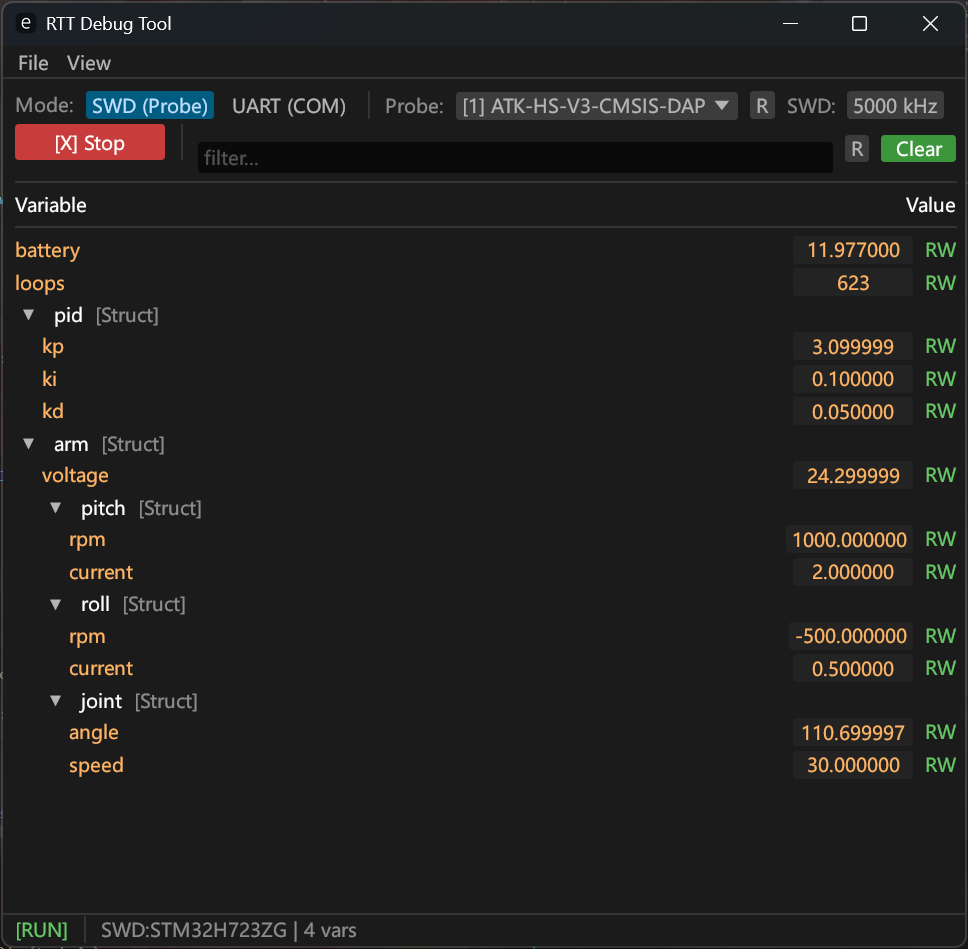
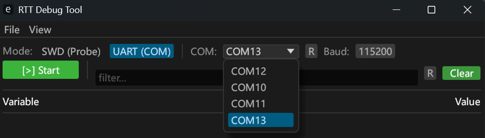
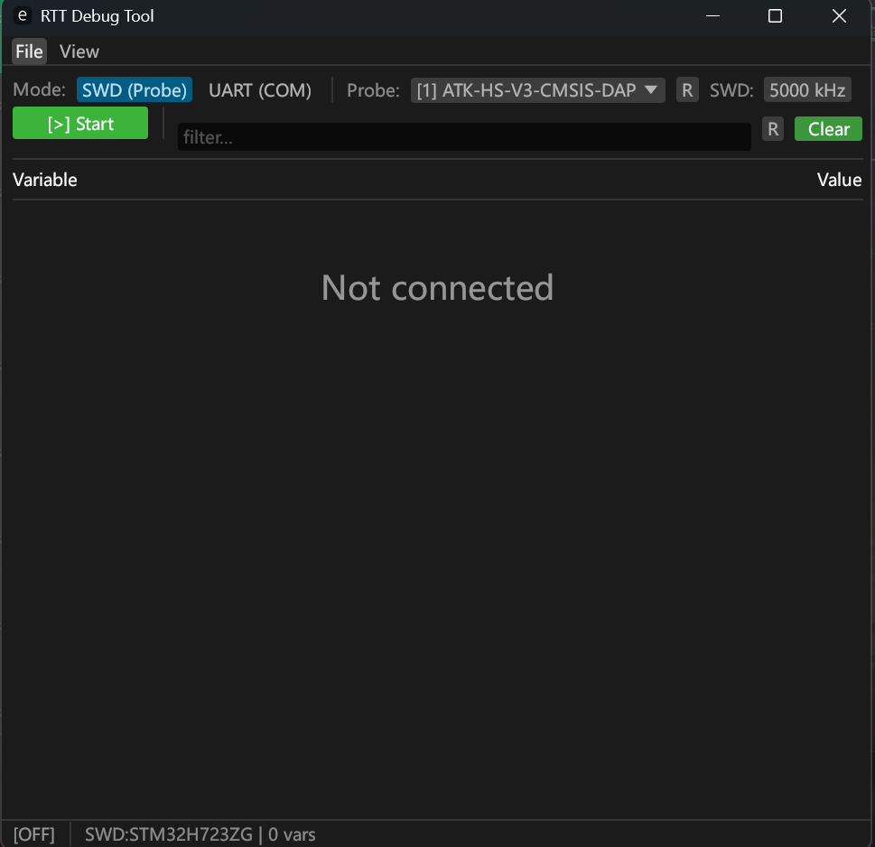

<h1 align="center">
  
  <br>
  Continuation of <a href="https://github.com/XieFField/RTT_DebugTool">RTT_DebugTool</a>
  <br>
</h1>

<h3 align="center">
A Debug Tool based on <a href="https://github.com/probe-rs/probe-rs">Probe-rs</a>
</h3>

<p align="center">
  Languages:
  <a href="./README.md">简体中文</a> ·
  <a href="./docs/README_en.md">English</a> ·
</p>
<hr style="height:2px; background-color:#eee; border:none;">
<div align="center">
<h2>页面预览</h2>

<!-- 表格宽度100%，无左右外边距，完全撑满 -->
<table style="width: 100%; margin: 0; border-collapse: collapse;">
  <!-- 第一行：描述文字 -->
  <tr>
    <th style="padding: 6px 2px; border: 1px solid #ddd; text-align: center; vertical-align: middle;">UART 连接图</th>
    <th style="padding: 6px 2px; border: 1px solid #ddd; text-align: center; vertical-align: middle;">SWD 连接图</th>
  </tr>
  <!-- 第二行：图片横向撑满单元格、高度放大、不变形 -->
  <tr>
    <td style="padding: 2px; border: 1px solid #ddd; text-align: center; vertical-align: middle;">
      
    </td>
    <td style="padding: 2px; border: 1px solid #ddd; text-align: center; vertical-align: middle;">
      
    </td>
  </tr>
</table>
</div>

<br>
<hr style="height:2px; background-color:#eee; border:none;">

<div align="center">
<h2><span style="color:#1890ff">如何使用RTT_DebugTool?</span></h2>
</div>
<br>

### 第一步 下载MCU侧的依赖
mcu侧总共两个依赖，但你只需要下载rtt-debug-tool-mcu即可
```bash
cargo add rtt-debug-tool-mcu
```
`rtt-debug-tool-mcu`库不提供任何特性。
你必须自己显式依赖` embassy-stm32 `并指定芯片型号，**因为芯片选择权已经交还给你**

### 第二步 下载RTT-DebugTool 主机软件
你可以下载仓库中的源码，`cargo run -p rtt-debug-tool`
也可以选择下载仓库`release`中的.exe文件直接运行，两种方式的效果都是相同的。

### 第三步 如何在mcu侧添加追踪变量
<br>

1. 如果你是串口版本，记得初始化一个uart
```rust
let uart = Uart::new(p.UART8,
        p.PE0, p.PE1, p.DMA1_CH7, p.DMA2_CH2, Irqs, uart_config).unwrap();
```

2. 添加观测变量你所需要知道和做的 (重要)

所有的注册宏如下
```rust
//使用宏注册的实例必须是 &'static RefCell<Arm> 类型

watch_scalar!//用于注册单个变量
watch_scalar!("battery", &VOLTAGE, ReadWrite); //示例

watch_struct!//用于注册结构体，需要用户手动展开结构体注册
watch_struct!("m1", ExternalMotor, &M1_CELL, { 
//需要手动展开目标结构体，可选择哪些成员要进行观测
    rpm:     f32 => ReadOnly,
    current: f32 => ReadWrite,
})

watch_struct_all!//默认全部成员ReadWrite 功能和watch_struct!相同

register_watch_fields! //默认全部成员ReadWrite 自动注册结构体
//使用register_watch_fields!自动注册的前提
//需要给目标结构体标记#[derive(Watch)]，程序才能识别自动展开
#[derive(Watch)]
struct Motor { rpm: f32, current: f32 } //非嵌套结构体示例

#[derive(Watch)]
struct Arm {                            //嵌套结构体示例
    voltage: f32,
    pitch: Motor,           // ← 自动平铺
    #[watch(readonly)]
    joint: Joint,           // ← 自动平铺 + 全字段只读
}
let arm: &'static RefCell<Arm> = ...
register_watch_fields("arm", arm);
// → arm.voltage
// → arm.pitch.rpm, arm.pitch.current
// → arm.joint.angle, arm.joint.speed
```
<br>
<p style="text-align: left;color:yellow"> 想让变量可注册你需要做的!</p>

由于观测变量需要可读可写，根据所有权规则
只能让 `&'static RefCell` 类型被注册

注册变量示例
```rust
#[derive(Watch)]
struct DJI_Motor{
  ...
}

static M1: StaticCell<RefCell<DJI_Motor>> = StaticCell::new();
let dji_motor1: &'static RefCell<DJI_Motor> = M1.init(RefCell::new(motor_id))
register_watch_fields("dji_motor1", dji_motor1); 
//这里你不想叫"dji_motor1"也行，名字自定
```

uart和swd模式的启动方式有所不同。

1. uart模式
```rust
// RTT 仅用于 rprintln! 日志 (ch0), 不需要 watch 通道
let channels = rtt_init! {
    up: { 0: { size: 1024, name: "Terminal" } }
};
rtt_target::set_print_channel(channels.up.0);
// 省去中间注册观测对象的步骤
spawner.must_spawn(debug_watch_task_uart(uart, watch_config!()));
```

2. swd模式
```rust
let channels = rtt_init! {
    up: { //实际上Terminal和Watch只能有一个同时工作
          //后面说明原因
        0: { size: 1024, name: "Terminal" }
        1: { size: 1024, name: "Watch" }
    }
    down: {
        0: { size: 128, name: "Command" }
    }
};
rtt_target::set_print_channel(channels.up.0);
let watch_cfg = watch_config!();
spawner.must_spawn(debug_watch_task(channels.up.1, channels.down.0, watch_cfg));
```
由于只能同时有一个进程占用调试器，所以SWD模式不能和vscode的调试模式共用(uart模式可以)

由于rtt的println所在进程和RTT-DebugTool不是同一个，所以也不能共用。

所以你初始化成如下形式也是可以的
```rust
let channels = rtt_init! {
    up: { //实际上Terminal和Watch只能有一个同时工作
          //后面说明原因
        0: { size: 1024, name: "Watch" }
    }
    down: {
        0: { size: 128, name: "Command" }
    }
};
let watch_cfg = watch_config!();
spawner.must_spawn(debug_watch_task(channels.up.0, channels.down.0, watch_cfg));
```
### 第三步 运行mcu程序和RTT-DebugTool
1. SWD模式


<p style = "text-align = left">设置好对应的连接速度和选择正确的探针后，点击</p> 就可以开始接收了
速度越高连接越快，但丢包率也会上升。
SWD模式的连接需要一点时间，我用正点原子的DAP-link在5000khz实测大概是3~4秒左右 



连接上后如图所示，RW的变量点击数据框即可编辑，操作逻辑与keil的watch窗口一般

2. UART模式



<div style="display: flex; align-items: center; gap: 8px;">
  <p style="margin: 0;">选择好对应的COM口和设置和mcu侧相同的波特率，点击  后就可以开始接收了</p>
</div>

<br>


3. clear
<div style="display: flex; align-items: center; gap: 8px;">
  <p style="margin: 0;">点击  清屏，用于断开后重新连接，擦除旧的变量树</p>
  <br>
  
  <p style="margin: 0;">如果你在连接的时候擦除，那么下一次接收到mcu侧消息时候会再次刷新出现</ps>
</div>

<br>



